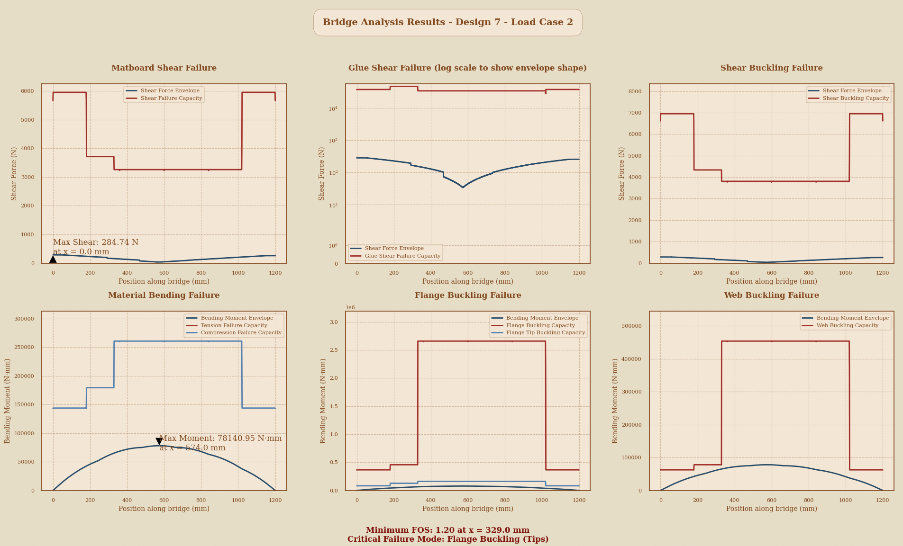
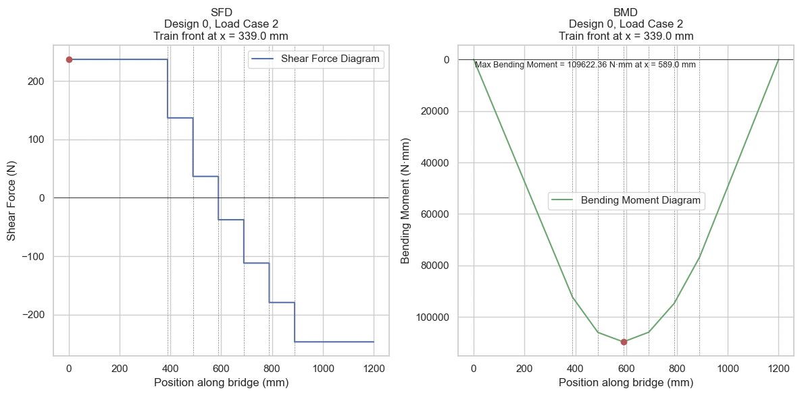

# Full Numerical and Graphical Bridge Analyzer for Box Girder-type Bridges
For CIV102

This project implements structural analysis tools for a thin-walled box girder bridge design, including shear force diagram (SFD), bending moment diagram (BMD), and failure analysis calculations.

## Table of Contents
- [Overview](#overview)
- [Theory](#theory)
- [Implementation](#implementation)
- [Results](#results)
- [Usage](#usage)

## Overview

This project provides tools for analyzing bridge designs under various loading conditions, specifically focusing on:
- Shear force and bending moment analysis
- Material failure analysis
- Buckling analysis
- 3D visualization of load effects

## Theory

### Plate Buckling Modes
The analysis considers eight different failure modes for thin-walled box girders:

| No. | Failure Mode | Description | Equation |
|-----|--------------|-------------|-----------|
| 1 | Tensile failure of walls | Material yielding in tension | σ = σ_ult+ |
| 2 | Compressive failure of walls | Material yielding in compression | σ = σ_ult- |
| 3 | Shear failure of walls | Material shear failure | τ = τ_ult |
| 4 | Shear failure of fastening material | Failure of connecting materials | τ = τ_m |
| 5 | Buckling of compressive flange | Buckling between webs | σ = (4π²E)/(12(1-μ²))(t/b)² |
| 6 | Buckling of flange tips | Buckling of unsupported edges | σ = (0.425π²E)/(12(1-μ²))(t/b)² |
| 7 | Web buckling due to flexure | Buckling from bending stresses | σ = (6π²E)/(12(1-μ²))(t/b)² |
| 8 | Shear buckling of webs | Buckling from shear stresses | τ = (5π²E)/(12(1-μ²))((t/h)² + (t/a)²) |

## Implementation

The project includes two main analysis scripts:
1. `bridge_analysis.py`: Main analysis tool including all failure modes
2. `SFDBMD.py`: Detailed shear force and bending moment analysis looping over each train position and finding max BMD and SFD for your given Load Case. Returns graph, train position, highest shear force/beending moment and position of it.

## Results

### Failure Analysis Results

*Failure analysis showing various failure modes and safety factors for a design with no variance in cross seciton*

*Failure analysis showing various failure modes and safety factors for a design with huge variance in cross section, thickness, splicing, diaphragm thickness, and more*
### SFD and BMD Results
*Shear Force and Bending Moment Diagrams for critical load positions*

*Shear Force and Bending Moment for Max Shear Force Load Case 1*

*Shear Force and Bending Moment Diagrams for Max BMD Load Case 2*

### 3D Load Effects Visualization

*3D visualization of shear force and bending moment distributions for all train positions*
